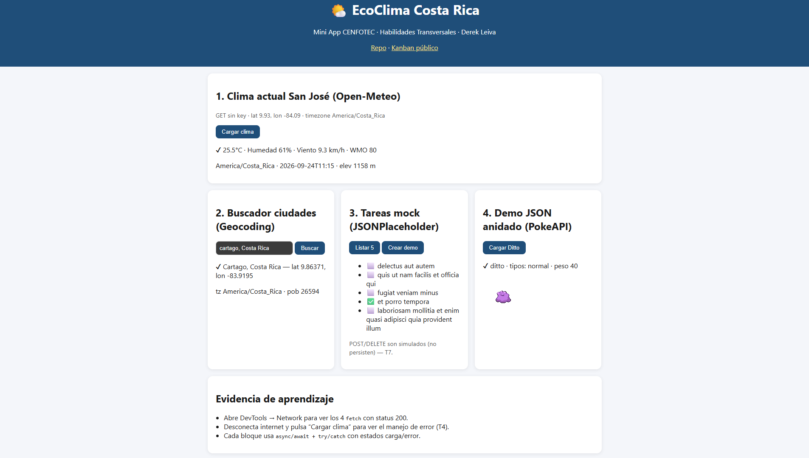

# EcoClima Costa Rica 🌤️

Mini App CENFOTEC · Habilidades Transversales · Derek Leiva — Astro minimal + 4 APIs públicas sin key.

- **Demo:** http://villalobossebas.me/ecoclima-cr/ (alternativa https://electromilitary45.github.io/ecoclima-cr/)
- **Kanban público:** https://github.com/users/electromilitary45/projects/19

## APIs (todas HTTP 200 verificadas 24/09/2026)

1. Open-Meteo Forecast — clima San José (9.93, −84.09)
2. Open-Meteo Geocoding — buscador ciudades (reemplaza a REST Countries v1–v4, deprecado 2026)
3. JSONPlaceholder — CRUD mock (T7)
4. PokeAPI Ditto — JSON anidado (T6)

## Dev

```bash
npm install
npm run dev
npm run build
```


